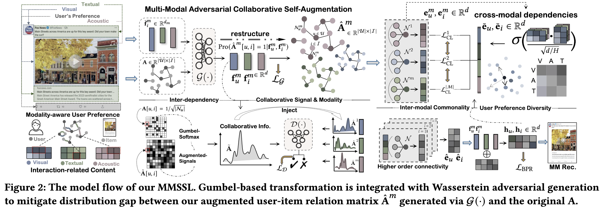

# MMSSL: Multi-Modal Self-Supervised Learning for Recommendation

PyTorch implementation for WWW 2023 paper [Multi-Modal Self-Supervised Learning for Recommendation](https://mmssl.files.wordpress.com/2023/02/3583206-2.pdf).

<p align="center">

</p>

MMSSL is a new multimedia recommender system MMSSL which integrates the generative modality-aware collaborative self-augmentation and the contrastive cross-modality dependency encoding. It achieves better performance than existing SOTA multi-model methods.


<h2>Dependencies </h2>

* Python >= 3.9.13
* [Pytorch](https://pytorch.org/) >= 1.13.0+cu116
* [dgl-cuda11.6](https://www.dgl.ai/) >= 0.9.1post1
* pyyaml == 5.4.1


<h2>Usage </h2>

Start training and inference as:

```
cd MMSSL
python main.py --dataset {DATASET}
```
Supported datasets:  `Amazon-Baby`, `Amazon-Sports`, `Tiktok`, `Allrecipes`


<h2> Datasets </h2>

  ```
  ├─ MMSSL/ 
      ├── data/
        ├── tiktok/
        ...
  ```
  |    Dataset   |   |  Amazon  |      |   |          |      |   |  Tiktok  |     |     |   | Allrecipes |    |
|:------------:|:-:|:--------:|:----:|:-:|:--------:|:----:|:-:|:--------:|:---:|:---:|:-:|:----------:|:--:|
|   Modality   |   |     V    |   T  |   |     V    |   T  |   |     V    |  A  |  T  |   |      V     |  T |
|   Embed Dim  |   |   4096   | 1048 |   |   4096   | 1048 |   |    128   | 128 | 768 |   |    2048    | 20 |
|     User     |   |   35598  |      |   |   19445  |      |   |   9319   |     |     |   |    19805   |    |
|     Item     |   |   18357  |      |   |   7050   |      |   |   6710   |     |     |   |    10067   |    |
| Interactions |   |  256308  |      |   |  139110  |      |   |   59541  |     |     |   |    58922   |    |
|   Sparsity   |   | 99.961\% |      |   | 99.899\% |      |   | 99.904\% |     |     |   |  99.970\%  |    |


- We provide processed data at [dropbox](https://www.dropbox.com/s/qrrm94ezzr0koqg/data.zip?dl=0). We spend a lot of time collecting datasets, if you want to use our datasets(especially Tiktok), please 'cite' in the article.

<h2> Experimental Results </h2>

Performance comparison of baselines on different datasets in terms of Recall@20, Precision@20 and NDCG@20:

|    Baseline    |        Tiktok        |                      |                      |           |      Amazon-Baby     |                      |                      |           |     Amazon-Sports    |                      |                      |           |      Allrecipes      |                      |                      |
|:--------------:|:--------------------:|:--------------------:|:--------------------:|-----------|:--------------------:|:--------------------:|:--------------------:|-----------|:--------------------:|:--------------------:|:--------------------:|-----------|:--------------------:|:--------------------:|:--------------------:|
|                |         R@20         |         P@20         |         N@20         |           |         R@20         |         P@20         |         N@20         |           |         R@20         |         P@20         |         N@20         |           |         R@20         |         P@20         |         N@20         |
|     MF-BPR     |        0.0346        |        0.0017        |        0.0130        |           |        0.0440        |        0.0024        |        0.0200        |           |        0.0430        |        0.0023        |        0.0202        |           |        0.0137        |        0.0007        |        0.0053        |
|      NGCF      |        0.0604        |        0.0030        |        0.0238        |           |        0.0591        |        0.0032        |        0.0261        |           |        0.0695        |        0.0037        |        0.0318        |           |        0.0165        |        0.0008        |        0.0059        |
|    LightGCN    |        0.0653        |        0.0033        |        0.0282        |           |        0.0698        |        0.0037        |        0.0319        |           |        0.0782        |        0.0042        |        0.0369        |           |        0.0212        |        0.0010        |        0.0076        |
|       SGL      |        0.0603        |        0.0030        |        0.0238        |           |        0.0678        |        0.0036        |        0.0296        |           |        0.0779        |        0.0041        |        0.0361        |           |        0.0191        |        0.0010        |        0.0069        |
|       NCL      |        0.0658        |        0.0034        |        0.0269        |           |        0.0703        |        0.0038        |        0.0311        |           |        0.0765        |        0.0040        |        0.0349        |           |        0.0224        |        0.0010        |        0.0077        |
|      HCCF      |        0.0662        |        0.0029        |        0.0267        |           |        0.0705        |        0.0037        |        0.0308        |           |        0.0779        |        0.0041        |        0.0361        |           |        0.0225        |        0.0011        |        0.0082        |
|      VBPR      |        0.0380        |        0.0018        |        0.0134        |           |        0.0486        |        0.0026        |        0.0213        |           |        0.0582        |        0.0031        |        0.0265        |           |        0.0159        |        0.0008        |        0.0056        |
|  LightGCN-$M$  |        0.0679        |        0.0034        |        0.0273        |           |        0.0726        |        0.0038        |        0.0329        |           |        0.0705        |        0.0035        |        0.0324        |           |        0.0235        |        0.0011        |        0.0081        |
|      MMGCN     |        0.0730        |        0.0036        |        0.0307        |           |        0.0640        |        0.0032        |        0.0284        |           |        0.0638        |        0.0034        |        0.0279        |           |        0.0261        |        0.0013        |        0.0101        |
|      GRCN      |        0.0804        |        0.0036        |        0.0350        |           |        0.0754        |        0.0040        |        0.0336        |           |        0.0833        |        0.0044        |        0.0377        |           |        0.0299        |        0.0015        |        0.0110        |
|     LATTICE    |        0.0843        |        0.0042        |  0.0367  |           |  0.0829  |  0.0044  |  0.0368  |           |  0.0915  |  0.0048  |  0.0424  |           |        0.0268        |        0.0014        |        0.0103        |
|     CLCRec     |        0.0621        |        0.0032        |        0.0264        |           |        0.0610        |        0.0032        |        0.0284        |           |        0.0651        |        0.0035        |        0.0301        |           |        0.0231        |        0.0010        |        0.0093        |
|      MMGCL     |        0.0799        |        0.0037        |        0.0326        |           |        0.0758        |        0.0041        |        0.0331        |           |        0.0875        |        0.0046        |        0.0409        |           |        0.0272        |        0.0014        |        0.0102        |
|     SLMRec     |  0.0845  |  0.0042  |        0.0353        |           |        0.0765        |        0.0043        |        0.0325        |           |        0.0829        |        0.0043        |        0.0376        |           |  0.0317  |  0.0016  |  0.0118  |
|     MMSSL    |    0.0921   |    0.0046   |    0.0392   |           |   0.0962   |    0.0051   |    0.0422   |           |    0.0998   |    0.0052   |    0.0470   |           |    0.0367   |   0.0018   |    0.0135   |
| p-value | 1.28e-5 | 7.12e-6 | 6.55e-6 |  | 2.23e-6 | 7.69e-6 | 8.65e-7 |  | 7.75e-6 | 6.48e-6 | 6.78e-7 |           | 3.94e-4 | 5.06e-6 | 4.31e-5 |
|     Improv.    |        8.99%        |        9.52%        |        6.81%        |           |        16.04%       |        15.91%       |        14.67%       |  |        9.07%        |        8.33%        |        10.85%       |  |        15.77%       |        12.50%       |        14.40%       |


Ablation study on key components of MMSSL:

|      Data      |   Amazon-Baby   |                 |    Allrecipes   |                 |      Tiktok     |                 |
|:--------------:|:---------------:|:---------------:|:---------------:|:---------------:|:---------------:|:---------------:|
|     Metrics    |      Recall     |       NDCG      |      Recall     |       NDCG      |      Recall     |       NDCG      |
| w/o-ASL |      0.0907     |      0.0396     |      0.0326     |      0.0124     |      0.0801     |      0.0358     |
|  w/o-CL |      0.0924     |      0.0408     |      0.0328     |      0.0130     |      0.0821     |      0.0351     |
|  w/o-GT |      0.0929     |      0.0405     |      0.0325     |      0.0121     |      0.0815     |      0.0353     |
| r/p-GAE |      0.0931     |      0.0411     |      0.0331     |      0.0126     |      0.0843     |      0.0364     |
|  MMSSL | 0.0962 | 0.0422 | 0.0367 | 0.0135 | 0.0921 | 0.0392 |


<h1> Citing </h1>

If you find this work is helpful to your research, please consider citing our paper:

```
@inproceedings{wei2023multi,
  title={Multi-Modal Self-Supervised Learning for Recommendation},
  author={Wei Wei, Chao Huang, Lianghao Xia, and Chuxu Zhang},
  booktitle={Proceedings of the Web Conference 2023},
  doi = {10.1145/3543507.3583206},
  year={2023}
}
```


## Acknowledgement

The structure of this code is largely based on [LATTICE](https://github.com/CRIPAC-DIG/LATTICE). Thank for their work.

